# App Comuna BC

Aplicación web para gestionar una comunidad rural. Combina un sitio público (información institucional + noticias) con un dashboard privado para operaciones administrativas como registro de comuneros, cuotas anuales, documentos, caja y control de acceso por roles.

## Capturas

### Sitio público

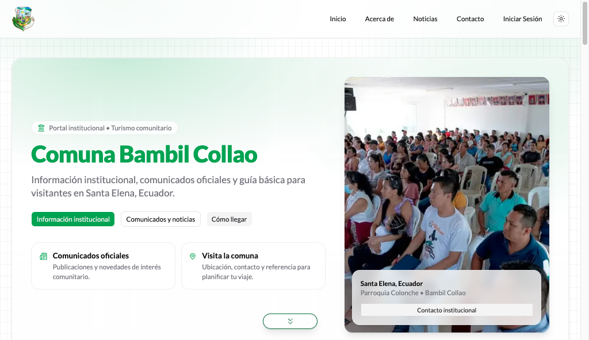

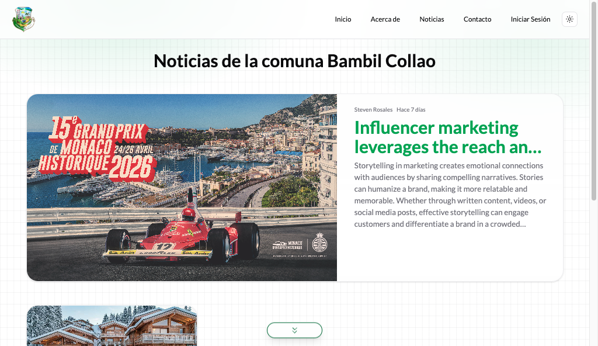


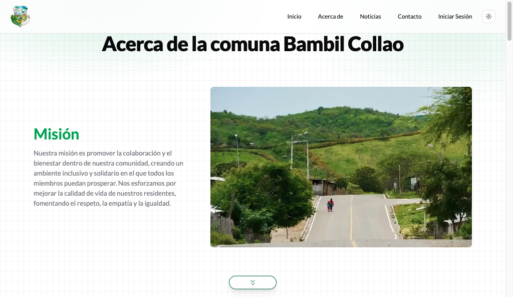

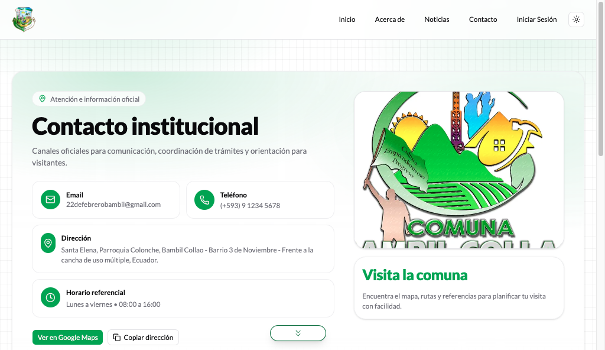

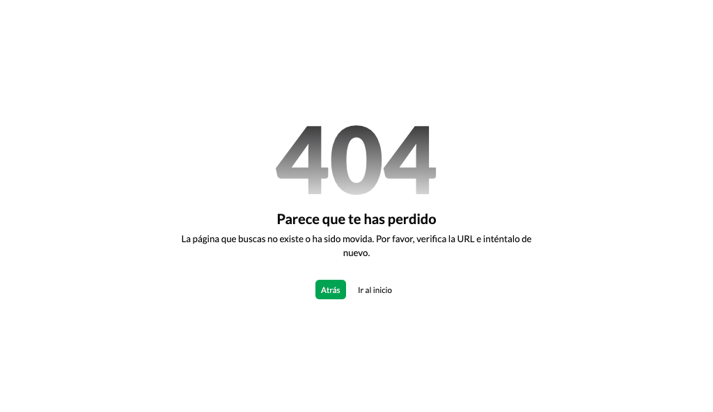

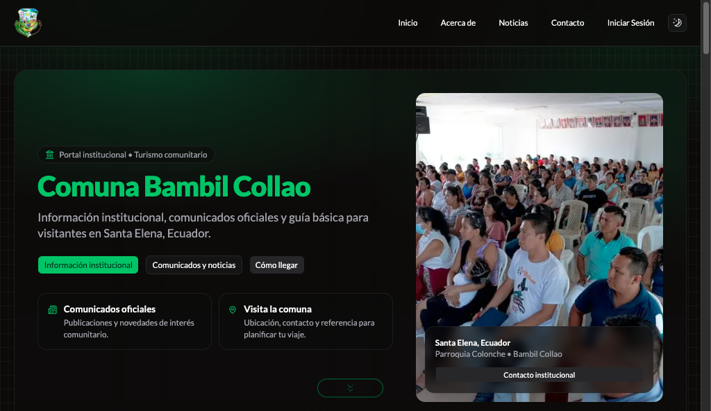

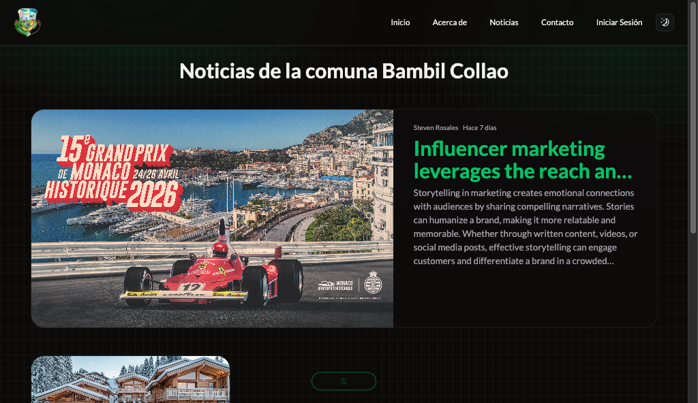


### Dashboard

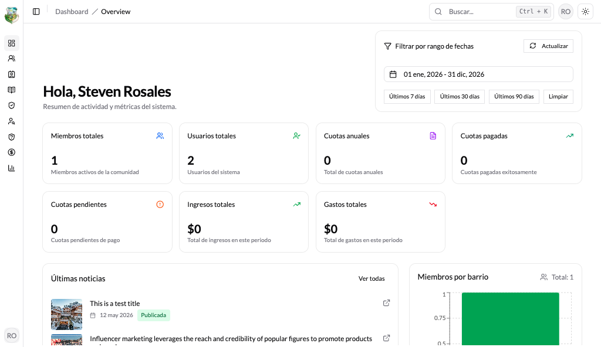

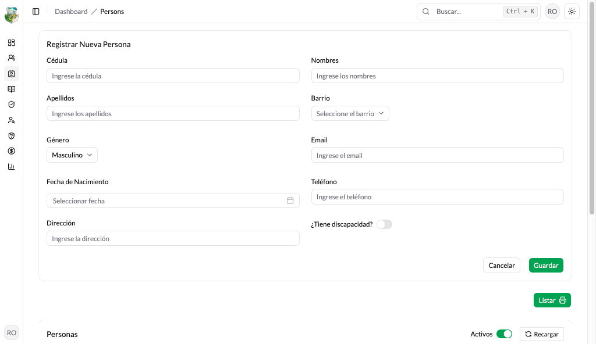

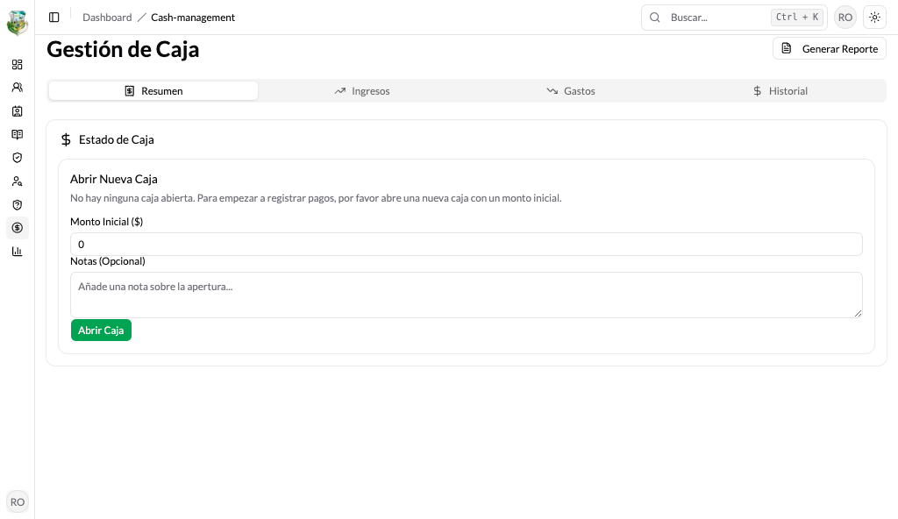

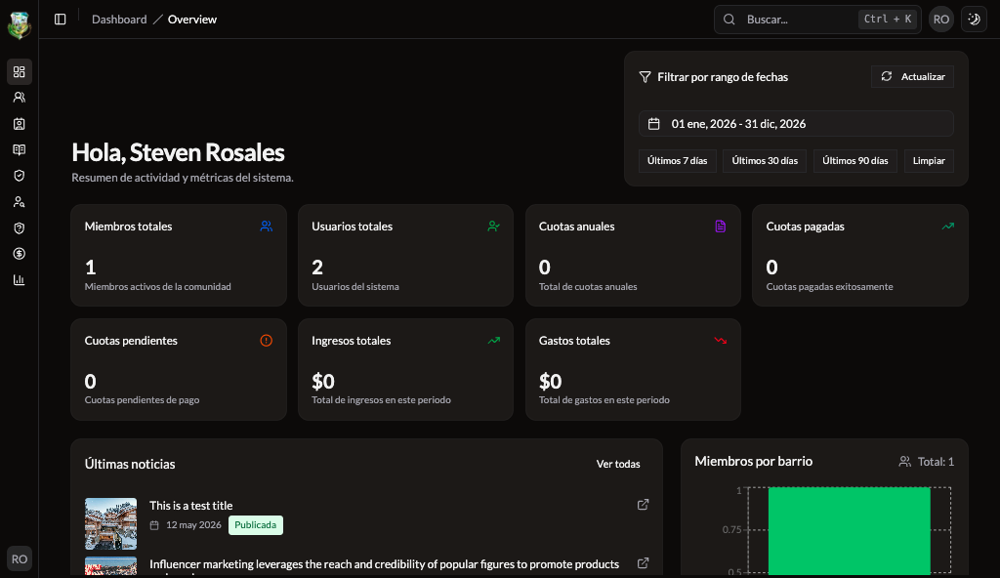

## Funcionalidades Principales

### Sitio público

- Página de inicio con información institucional y datos destacados de la comunidad
- Listado de noticias/publicaciones y páginas de detalle con SEO
- Páginas de Acerca de y Contacto
- Soporte de modo oscuro

### Dashboard privado (RBAC)

- Registro de personas (persons) y gestión de comuneros
- Control de cuotas anuales y pagos de miembros
- Gestión de catálogos de requisitos y tipos de documento
- Gestión de catálogos de barrios/sectores
- Backoffice de noticias (crear, editar, previsualizar, publicar) con editor de texto enriquecido
- Gestión de caja (historial de ingresos/egresos, recibos/facturación)
- Gestión de usuarios y roles con permisos por módulo/acción
- Utilidades de reportes/exportación

## Stack Tecnológico

- Next.js (App Router) + React + TypeScript
- Tailwind CSS + shadcn/ui (Radix UI)
- Auth.js (NextAuth v5 beta)
- TanStack Query + TanStack Table
- React Hook Form + Zod
- next-themes (theme switcher)
- Proveedores de almacenamiento opcionales: MinIO (compatible S3) e ImageKit

## Estructura del Proyecto

```text
src/
  app/
    (page)/                 # Sitio público (home, notices, about, contact)
    auth/                   # Páginas de autenticación (login, reset password, etc.)
    dashboard/              # Dashboard privado
    api/                    # Rutas API de Next.js (ej. images proxy)
  components/               # Componentes compartidos y UI del sitio/dashboard
  features/                 # Módulos por feature (overview, profile, products, kanban, etc.)
  hooks/                    # Hooks compartidos (react-query hooks, utilities)
  lib/                      # Utilidades core (api client, auth config, helpers)
  services/                 # Capa de servicios (persons, members, notices, cash, etc.)
  constants/                # Constantes (permissions, navigation, translations)
  types/                    # Tipos TypeScript compartidos
```

## Inicio Rápido (Local)

### Requisitos

- Node.js + pnpm
- API backend corriendo (por defecto: `http://localhost:8000/api`)
- (Opcional) MinIO corriendo (por defecto: `http://localhost:9000`) si `STORAGE_PROVIDER=minio`

### Instalación

```bash
pnpm install
```

### Variables de Entorno

Copia el archivo de ejemplo y ajusta los valores según tu entorno:

```bash
cp .env.example .env.local
```

Variables comunes:

| Variable | Descripción |
| --- | --- |
| `NEXT_PUBLIC_APP_URL` | URL pública de la app (usada en SEO/canonical) |
| `NEXT_PUBLIC_API_URL` | Base URL del backend API |
| `NEXT_PUBLIC_CACHE_REVALIDATE` | Intervalo de revalidación de caché (segundos) |
| `STORAGE_PROVIDER` | `minio` u otro proveedor |
| `NEXT_IMAGE_REMOTE_HOSTS` | Hosts remotos permitidos para imágenes |
| `MINIO_ENDPOINT` | URL del endpoint de MinIO |
| `MINIO_PUBLIC_URL` | URL pública para resolver objetos |
| `MINIO_ACCESS_KEY` | Access key de MinIO |
| `MINIO_SECRET_KEY` | Secret key de MinIO |
| `MINIO_BUCKET` | Nombre del bucket |
| `MINIO_REGION` | Región del bucket |
| `IMAGEKIT_URL_ENDPOINT` | Endpoint de ImageKit (opcional) |
| `IMAGEKIT_PUBLIC_KEY` | Public key de ImageKit (opcional) |
| `IMAGEKIT_PRIVATE_KEY` | Private key de ImageKit (opcional) |

### Ejecutar

```bash
pnpm dev
```

Abrir `http://localhost:3000`.

## Scripts

```bash
pnpm dev
pnpm build
pnpm start
pnpm lint
pnpm lint:fix
pnpm format
```

## Notas

- El sistema de diseño usa tokens de Tailwind (`bg-background`, `text-foreground`, etc.) para mantener consistencia entre modo claro/oscuro.
- Evita commitear secretos. Mantén `.env.local` solo en local y usa `.env.example` como referencia.
